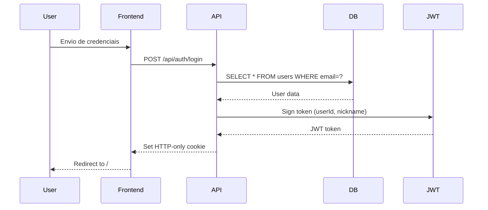
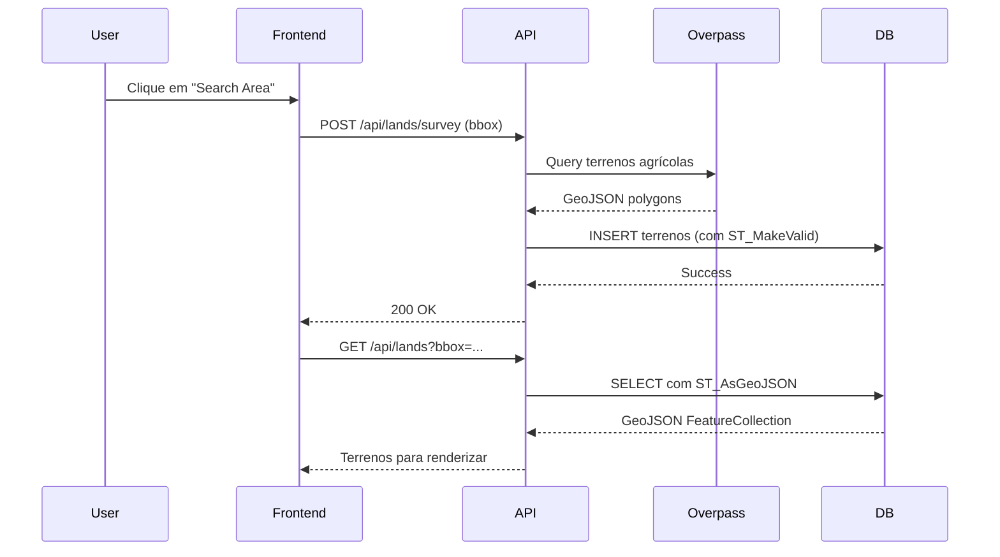
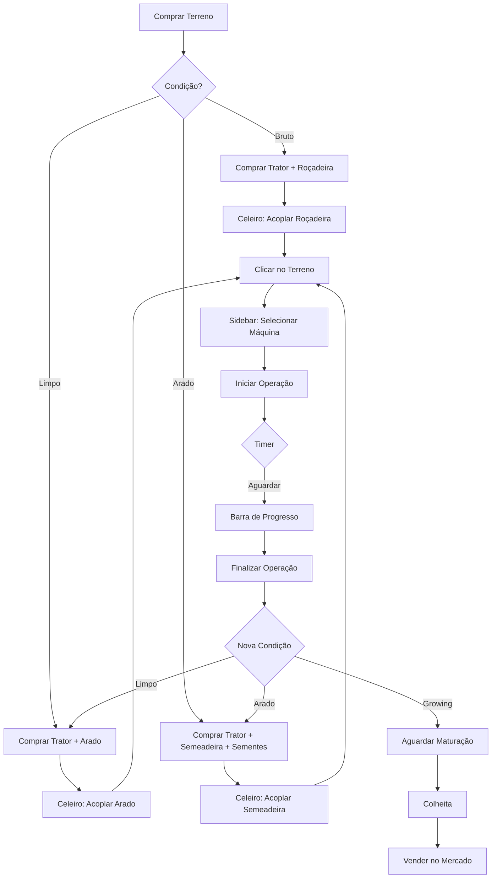

# Farming Manager - Sistema de Gerenciamento Agrícola

## Visão Geral do Projeto

O **Farming Manager** é uma aplicação web full-stack de simulação de gerenciamento agrícola baseada em mapas reais. Os jogadores podem:
- Comprar terrenos rurais reais (dados do OpenStreetMap)
- Gerenciar frota de tratores e implementos
- Realizar operações agrícolas (limpeza, aragem, plantio, colheita)
- Acompanhar operações em tempo real com timers
- Vender produtos no mercado

---

## Stack Tecnológica

### Frontend
- **Framework**: Next.js 14 (App Router)
- **UI Library**: React 18
- **Styling**: Tailwind CSS
- **Maps**: Leaflet + react-leaflet
- **Icons**: lucide-react
- **Language**: TypeScript

### Backend
- **Runtime**: Node.js (Next.js API Routes)
- **Database**: PostgreSQL 16 + PostGIS
- **ORM**: Nenhum (SQL direto via `pg`)
- **Authentication**: JWT (HTTP-only cookies)

### External APIs
- **Overpass API**: Busca de polígonos de terrenos agrícolas do OpenStreetMap
- **ArcGIS**: Camadas de mapa (satélite + labels)

---

## Arquitetura do Sistema

### Estrutura de Diretórios

```
farmingManager/
├── src/
│   ├── app/                      # Next.js App Router
│   │   ├── (auth)/              # Rotas de autenticação
│   │   │   ├── login/
│   │   │   └── register/
│   │   ├── api/                 # API Routes
│   │   │   ├── auth/           # Autenticação (login, register, me)
│   │   │   ├── lands/          # Terrenos (list, survey)
│   │   │   └── game/           # Gameplay
│   │   │       ├── buy/        # Compra de terrenos
│   │   │       ├── shop/       # Loja de equipamentos
│   │   │       ├── inventory/  # Inventário do jogador
│   │   │       ├── farm/       # Operações agrícolas
│   │   │       └── my-lands/   # Lista de terrenos próprios
│   │   ├── layout.tsx          # Layout global
│   │   └── page.tsx            # Página principal (mapa)
│   │
│   ├── components/
│   │   ├── Map/
│   │   │   └── GameMap.tsx     # Componente principal do mapa
│   │   └── HUD/                # Componentes de interface
│   │       ├── TopBar.tsx      # Barra superior (saldo, diamantes)
│   │       ├── ShopModal.tsx   # Loja de equipamentos
│   │       ├── BarnModal.tsx   # Gerenciamento de frota
│   │       ├── LandSidebar.tsx # Sidebar de detalhes do terreno
│   │       └── LandsOverviewSidebar.tsx  # Painel de visão geral
│   │
│   ├── lib/                    # Lógica de negócio
│   │   ├── db.ts              # Cliente PostgreSQL + helper de transações
│   │   ├── auth.ts            # Autenticação JWT
│   │   ├── landGenerator.ts   # Geração de terrenos via Overpass
│   │   ├── gameService.ts     # Compra de terrenos
│   │   ├── inventoryService.ts # Compra/equipamento de itens
│   │   └── farmingService.ts  # Lógica de operações agrícolas
│   │
│   └── scripts/               # Scripts de setup
│       ├── setup_db.ts        # Schema inicial (users, lands)
│       ├── setup_gameplay_db.ts # Schema de gameplay
│       └── seed_items.ts      # Seed de equipamentos
│
├── docs/                      # Documentação
│   └── land-generation.md
│
└── .env                       # Variáveis de ambiente
```

---

## Fluxo de Dados

### 1. Autenticação



**Segurança:**
- Senhas hashadas com `bcrypt` (salt rounds: 10)
- JWT armazenado em HTTP-only cookie
- `SameSite: 'lax'` para CSRF protection
- `secure` flag em produção

### 2. Geração de Terrenos



**Algoritmo "Inverse Search":**
1. Busca direta por `landuse=farmland/meadow/orchard`
2. Converte para polígonos válidos via `ST_MakeValid`
3. Calcula área, preço base, condição aleatória
4. Insere no banco com geometria PostGIS

**Retry Logic:**
- 3 servidores Overpass (overpass-api.de, kumi.systems, mail.ru)
- Timeout de 180s
- Max zoom-out: 10 (para evitar sobrecarga)

### 3. Ciclo de Gameplay



---

## Banco de Dados

### Schema

#### `users`
```sql
CREATE TABLE users (
    id SERIAL PRIMARY KEY,
    email VARCHAR(255) UNIQUE NOT NULL,
    password VARCHAR(255) NOT NULL,      -- bcrypt hash
    nickname VARCHAR(100) NOT NULL,
    money DECIMAL(15, 2) DEFAULT 100000.00,
    diamonds INTEGER DEFAULT 0,
    created_at TIMESTAMP DEFAULT NOW()
);
```

#### `lands`
```sql
CREATE TABLE lands (
    id UUID PRIMARY KEY DEFAULT gen_random_uuid(),
    land_type VARCHAR(100),              -- farmland, meadow, orchard
    area_sqm DECIMAL(12, 2),
    geom GEOMETRY(Polygon, 4326),        -- PostGIS
    price DECIMAL(15, 2),
    condition VARCHAR(50),               -- bruto, limpo, arado, growing
    status VARCHAR(50) DEFAULT 'disponivel',  -- disponivel, comprado
    owner_id INTEGER REFERENCES users(id),
    is_generated BOOLEAN DEFAULT TRUE,
    
    -- Operações
    operation_start TIMESTAMP,
    operation_end TIMESTAMP,
    operation_type VARCHAR(50),          -- clean, plow, sow, harvest
    current_crop_id INTEGER REFERENCES game_items(id)
);

CREATE INDEX idx_lands_geom ON lands USING GIST(geom);
CREATE INDEX idx_lands_status ON lands(status);
CREATE INDEX idx_lands_owner ON lands(owner_id);
```

#### `game_items`
```sql
CREATE TABLE game_items (
    id SERIAL PRIMARY KEY,
    name VARCHAR(255),
    type VARCHAR(50),                    -- tractor, implement, heavy, seed
    category VARCHAR(50),                -- plow, seeder, cleaner, etc
    price DECIMAL(15, 2),
    description TEXT,
    image_url TEXT,
    stats JSONB                          -- { hp, efficiency, req_hp, ... }
);
```

**Exemplo de stats:**
```json
{
  "hp": 75,                    // Cavalos (tractor)
  "speed_multiplier": 1.0,     // Multiplicador de velocidade
  "req_hp": 50,                // HP requerido (implement)
  "efficiency": 0.8,           // Ha/h (implement)
  "operation": "cleaning",     // Tipo de operação (heavy)
  "yield_kg_ha": 3500,        // Produtividade (seed)
  "growth_time": 120,         // Tempo crescimento em segundos (seed)
  "kg_per_ha": 80             // Uso de semente por hectare (seed)
}
```

#### `inventory`
```sql
CREATE TABLE inventory (
    id SERIAL PRIMARY KEY,
    user_id INTEGER REFERENCES users(id),
    item_id INTEGER REFERENCES game_items(id),
    quantity INTEGER DEFAULT 1,
    instance_id UUID DEFAULT gen_random_uuid(),  -- ID único para máquinas
    attached_to UUID,                           -- instance_id do trator (para implements)
    created_at TIMESTAMP DEFAULT NOW()
);

CREATE INDEX idx_inventory_user ON inventory(user_id);
CREATE INDEX idx_inventory_attached ON inventory(attached_to);
```

---

## Serviços Backend

### `lib/auth.ts`

**Funções:**
- `hashPassword(plainText)`: bcrypt hash
- `verifyPassword(plainText, hash)`: Validação
- `signToken(payload)`: Gera JWT
- `verifyToken(token)`: Valida JWT
- `getSession()`: Extrai sessão do cookie Next.js

### `lib/gameService.ts`

**Funções:**
- `buyLand(userId, landId)`: Compra terreno
  - Valida saldo
  - Usa transação para atomicidade
  - Atualiza `owner_id` e `status`

### `lib/inventoryService.ts`

**Funções:**
- `getInventory(userId)`: Retorna inventário formatado
- `buyItem(userId, itemId, quantity)`:
  - Deduz dinheiro
  - Cria `instance_id` único para máquinas
  - Stackable items (seeds) somam quantity
- `equipImplement(userId, tractorInvId, implementInvId)`:
  - Valida HP: `tractor.hp >= implement.req_hp`
  - Seta `attached_to = tractor.instance_id`
- `unequipImplement(userId, implementInvId)`:
  - Remove `attached_to`

### `lib/farmingService.ts`

**Funções:**
- `startAction(userId, landId, action, toolInvId)`:
  1. Valida propriedade do terreno
  2. Valida condição vs ação (bruto→clean, limpo→plow, arado→sow)
  3. Valida equipamento (HP, categoria)
  4. Calcula duração: `(area_ha × 30s) / efficiency`
  5. Bloqueia terreno: seta `operation_start/end/type`

- `finishOperation(userId, landId)`:
  1. Valida que `operation_end` já passou
  2. Atualiza condição: bruto→limpo, limpo→arado, arado→growing
  3. Limpa campos de operação

**Game Time Factor:**
- Base: 30 segundos por hectare por unidade de eficiência
- Exemplo: 10ha com eficiência 2.0 = (10 × 30) / 2 = 150s

---

## Componentes Frontend

### `GameMap.tsx`

**Estados:**
```tsx
- lands: GeoJSON FeatureCollection
- bounds: L.LatLngBounds (viewport)
- selectedLand: Dados do terreno clicado
- isOverviewOpen: Sidebar de overview aberta?
- discoveryMode: Toggle de busca de campos
- currentZoom: Nível de zoom atual
```

**Modos de Operação:**

**Discovery Mode (ON):**
- Busca terrenos disponíveis via `/api/lands?bbox=...`
- Requisições contínuas ao mover mapa
- Zoom mínimo 10 (proteção de sobrecarga)
- Mostra terrenos disponíveis + próprios

**Owned Lands Mode (OFF):**
- Busca apenas terrenos próprios via `/api/game/my-lands`
- Requisição única ao alterar modo
- Aplica blur no mapa: `backdropFilter: 'blur(2px) brightness(0.7)'`
- Foco em gerenciamento

**Event Handlers:**
```tsx
onEachFeature: (feature, layer) => {
  if (isOwned) {
    layer.on('click', () => setSelectedLand(feature));
  } else {
    layer.bindPopup(buyButton);
  }
}
```

### `ShopModal.tsx`

**Tabs:**
- **Tratores**: Leve (75cv), Médio (150cv), Pesado (370cv)
- **Implementos**: Arados, Semeadeiras, Roçadeiras
- **Pesados**: Colheitadeiras, Escavadeiras
- **Sementes**: Soja, Milho (com stats de produtividade)

**Fluxo de Compra:**
1. Click "COMPRAR"
2. Se seed: prompt quantidade
3. POST `/api/game/shop` com `{ itemId, quantity }`
4. Debita dinheiro, adiciona ao inventário
5. Dispara evento `game_update` para atualizar TopBar

### `BarnModal.tsx`

**Funcionalidades:**
- Lista tratores com cards visuais
- Botão "Acoplar Implemento" por trator
- Modal de seleção de implementos compatíveis
- Validação de HP ao acoplar
- Indicador visual de implemento acoplado

**Validação:**
```tsx
const canEquip = tractor.stats.hp >= implement.stats.req_hp;
```

### `LandSidebar.tsx`

**Informações Exibidas:**
- Área (hectares)
- Condição atual (bruto/limpo/arado/growing)
- Timer em tempo real (HH:MM:SS) se operação ativa
- Barra de progresso calculada: `(elapsed / totalDuration) × 100`

**Lógica de Ações:**
```tsx
getCompatibleTools(action) {
  // Filtra inventário por:
  // 1. Heavy machines com operation correta
  // 2. Tractors com implement acoplado da categoria certa
  
  return inventory.filter(item => {
    if (item.type === 'heavy') return item.stats.operation === actionMap[action];
    if (item.type === 'tractor') {
      const implement = inventory.find(
        imp => imp.attached_to === item.instance_id
      );
      return implement?.category === categoryMap[action];
    }
  });
}
```

### `LandsOverviewSidebar.tsx`

**Filtros:**
- **Todos**: Todas as propriedades
- **Aguardando**: Precisa de ação (sem operação ativa)
- **Ativos**: Operações em andamento
- **Prontos**: Operações concluídas (clicar para finalizar)

**Auto-refresh:**
- Interval de 10 segundos
- Atualiza timers e status

---

## API Routes

### Autenticação

#### `POST /api/auth/register`
```typescript
Body: { email, password, nickname }
Response: { success: true } + Set-Cookie
```

#### `POST /api/auth/login`
```typescript
Body: { email, password }
Response: { success: true, user } + Set-Cookie
```

#### `GET /api/auth/me`
```typescript
Headers: Cookie (JWT)
Response: { user: { id, email, nickname, money, diamonds } }
```

### Terrenos

#### `GET /api/lands?bbox=west,south,east,north`
```typescript
Response: {
  type: "FeatureCollection",
  features: [{
    type: "Feature",
    properties: { id, land_type, area_sqm, condition, price, status },
    geometry: { type: "Polygon", coordinates: [...] }
  }]
}
```

#### `POST /api/lands/survey`
```typescript
Body: { bounds: { south, west, north, east } }
Process:
  1. Overpass query para farmlands
  2. Parse GeoJSON
  3. Validar polígonos (ST_MakeValid)
  4. Inserir no banco
Response: { message, count }
```

### Gameplay

#### `POST /api/game/buy`
```typescript
Body: { landId: UUID }
Process:
  - Transação: debitar dinheiro + atualizar owner_id
Response: { success: true }
```

#### `GET /api/game/shop?category=tractor`
```typescript
Response: { items: [{ id, name, type, category, price, stats, ... }] }
```

#### `POST /api/game/shop`
```typescript
Body: { itemId: number, quantity: number }
Response: { success: true }
```

#### `GET /api/game/inventory`
```typescript
Response: {
  inventory: [{
    id, item_id, name, type, category, stats, image_url,
    instance_id, attached_to, quantity
  }]
}
```

#### `POST /api/game/inventory`
```typescript
Body: { action: 'equip', tractorId, implementId }
  OR { action: 'unequip', implementId }
Response: { success: true }
```

#### `POST /api/game/farm`
```typescript
Body: { type: 'start', action: 'clean', landId, toolInvId }
  OR { type: 'finish', landId }
Response: { success: true, duration, endTime }
  OR { completed: true, newCondition }
```

#### `GET /api/game/my-lands`
```typescript
Response: {
  lands: [{
    id, land_type, condition, area_sqm,
    operation_start, operation_end, operation_type,
    geojson, area_ha, is_active, is_finished, time_remaining
  }]
}
```

---

## Eventos Customizados

### `game_update`

**Quando disparado:**
- Após compra de terreno
- Após compra de item na loja
- Após finalização de operação

**Quem escuta:**
- `TopBar.tsx`: Atualiza saldo e diamantes
- `LandsOverviewSidebar.tsx`: Refresh da lista de terrenos

**Implementação:**
```typescript
// Disparo
window.dispatchEvent(new Event('game_update'));

// Escuta
useEffect(() => {
  const handler = () => fetchUser();
  window.addEventListener('game_update', handler);
  return () => window.removeEventListener('game_update', handler);
}, []);
```

---

## Variáveis de Ambiente

```env
# Database
POSTGRES_USER=seu_usuario
POSTGRES_PASSWORD=sua_senha
POSTGRES_HOST=localhost
POSTGRES_PORT=5432
POSTGRES_DB=farming_manager

# JWT
JWT_SECRET=seu_secret_super_seguro_aqui
```

---

## Scripts de Setup

### 1. Database Inicial
```bash
npx tsx src/scripts/setup_db.ts
```
Cria: `users`, `lands`, extensões PostGIS

### 2. Gameplay Tables
```bash
npx tsx src/scripts/setup_gameplay_db.ts
```
Cria: `game_items`, `inventory`, adiciona colunas em `lands`

### 3. Seed Items
```bash
npx tsx src/scripts/seed_items.ts
```
Popula `game_items` com tratores, implementos, sementes

---

## Padrões de Código

### Transações no Backend
```typescript
import { transaction } from '@/lib/db';

export async function buyLand(userId: number, landId: string) {
  return await transaction(async (client) => {
    // Todas as queries usam o mesmo client
    const land = await client.query('SELECT * FROM lands WHERE id = $1', [landId]);
    const user = await client.query('UPDATE users SET money = money - $1 WHERE id = $2', [price, userId]);
    // Commit automático se nenhum erro
  });
}
```

### Type Safety
```typescript
// Evitar 'any' - usar tipos específicos
type Land = {
  id: string;
  land_type: string;
  area_sqm: number;
  condition: 'bruto' | 'limpo' | 'arado' | 'growing';
  status: 'disponivel' | 'comprado';
  operation_start?: Date;
  operation_end?: Date;
  operation_type?: 'clean' | 'plow' | 'sow' | 'harvest';
};
```

### Error Handling
```typescript
try {
  const res = await fetch('/api/endpoint');
  const data = await res.json();
  if (data.success) {
    // Handle success
  } else {
    alert('Erro: ' + data.error);
  }
} catch (e) {
  console.error(e);
  alert('Erro de conexão');
}
```

---

## Problemas Conhecidos

### 1. Lint Warnings (Não Críticos)
- `z-[1000]` → Tailwind JIT syntax válida mas linter sugere `z-1000`
- `bg-gradient-to-r` → Linter sugere `bg-linear-to-r` mas não é válido
- GeoJSON type mismatch → Incompatibilidade entre `@types/geojson` e Leaflet

### 2. Performance
- Fetching em zoom muito baixo pode retornar muitos polígonos
- Solução: Limitar zoom mínimo a 10 no Discovery Mode

### 3. Timer Drift
- Timers frontend podem dessincronizar se tab inativa
- Solução: Re-fetch ao reabrir sidebar

---

## Próximos Passos

Ver arquivo `NEXT_STEPS.md` para roadmap detalhado.

---

## Deployment

### Requerimentos
- Node.js 18+
- PostgreSQL 16+ com PostGIS 3.4+
- Variáveis de ambiente configuradas

### Build
```bash
npm run build
npm start
```

### Docker (Opcional)
```dockerfile
FROM node:18-alpine
WORKDIR /app
COPY package*.json ./
RUN npm ci --only=production
COPY . .
RUN npm run build
CMD ["npm", "start"]
```

---

## Contribuindo

1. Clone o repositório
2. Configure `.env`
3. Execute scripts de setup
4. `npm run dev`
5. Acesse `http://localhost:3000`

---

## Licença

Proprietário - Nathan (@nathanitau)
